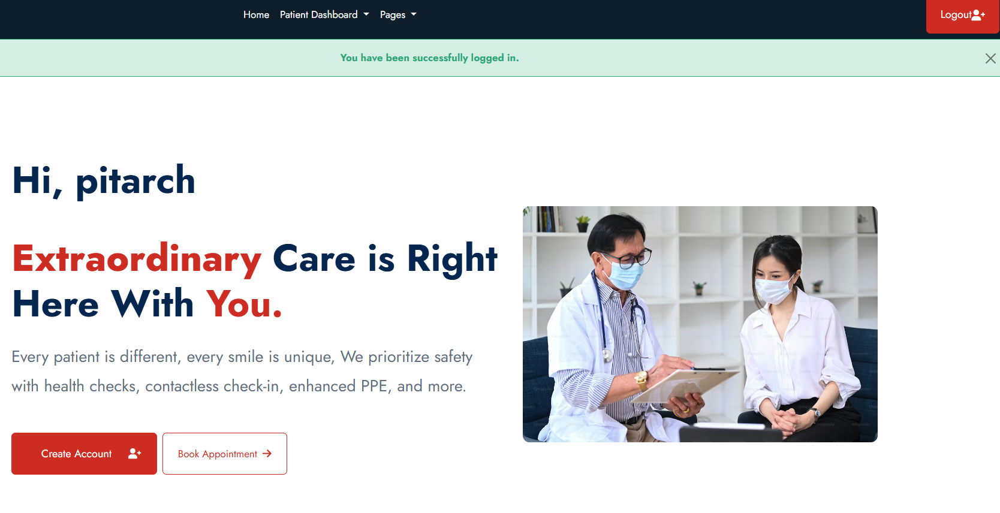
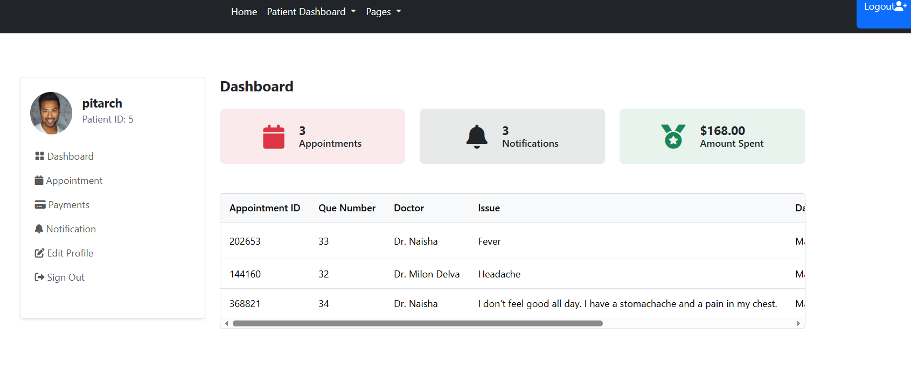
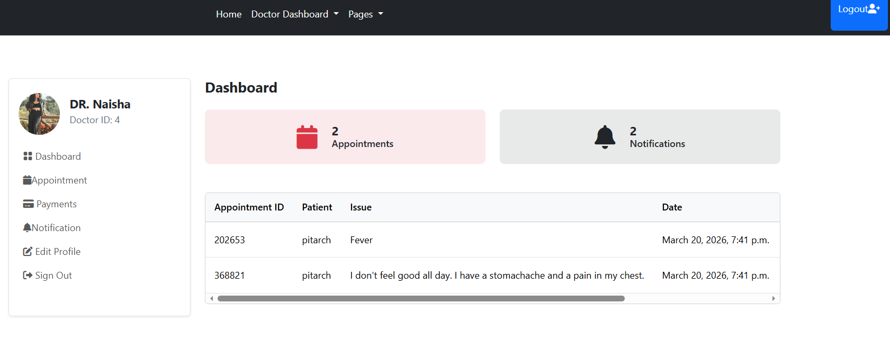
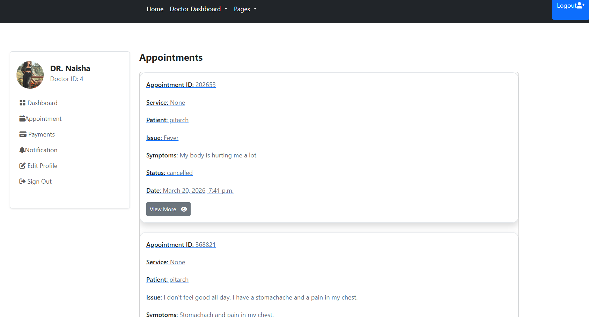

### Hospital Management System

## Tech Stack used for this project
✅Python
✅Django
✅JavaScript
✅PostgreSQL
✅Bootstrap
✅HTML
✅Stripe
✅PayPal
✅Email (Mailgun)
✅Notifications
✅Dashboard
✅Role-based authentication

## Project Overview
This is a Hospital Management System web application where patients can book appointments with doctors based on doctor availability. Doctors can manage appointments, add prescriptions, and track payments through their dashboard.

The system includes authentication, role-based access (Doctor/Patient), payment integration, email notifications, and appointment management.

## Features

User registration and authentication

Role-based login (Doctor or Patient)

User profile management

Doctor availability scheduling

Appointment booking system

Online payments with Stripe and PayPal

Email notifications for appointment confirmation

Notification system for doctors and patients

Doctors can add prescriptions and treatment plans

Doctors can manage appointment status (Booked, Completed, Cancelled)

Patients can view prescriptions and payment history

Doctors can track total earnings

Dashboard for doctors and patients

## Access Restrictions
Doctors cannot book appointments

Only patients can book appointments

Users must be logged in to book appointments

Patients cannot access the doctor's dashboard

Doctors cannot access the patient's dashboard

## Installation & Setup
git clone <your-repository-url>
cd hospitalmanagementapp

# Create virtual environment
python -m venv venv

# Activate environment
# Windows
venv\Scripts\activate

# Mac/Linux
source venv/bin/activate

# Install dependencies
pip install -r requirements.txt

# Run migrations
python manage.py migrate

# Start server
python manage.py runserver

#### Future Improvements
- Send email to patient when doctors update the appointment status 
- Send email to patient when doctors add prescription, medical reports, labtest and cancel or mark an appointment as completed.
- Send Email to Doctor when patient cancel an appointment
- Add REST API with Django REST Framework
- Add Docker support
- Add WebSocket notifications
- Add a messaging system for users and doctors to communicate
- Add Redis caching
- Add background tasks with Celery
- Deploy to AWS